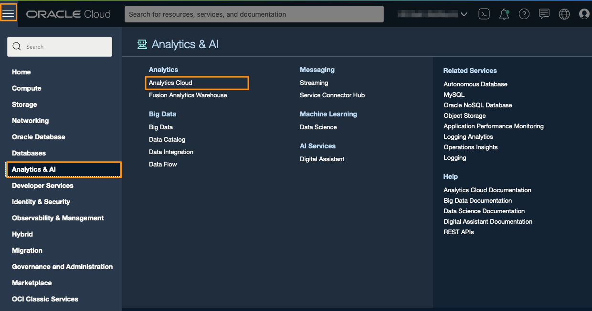
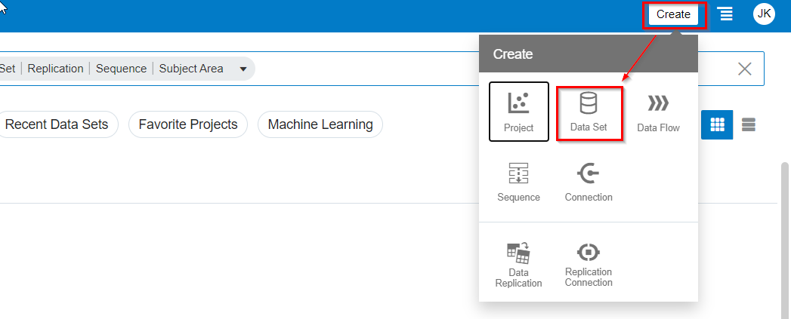
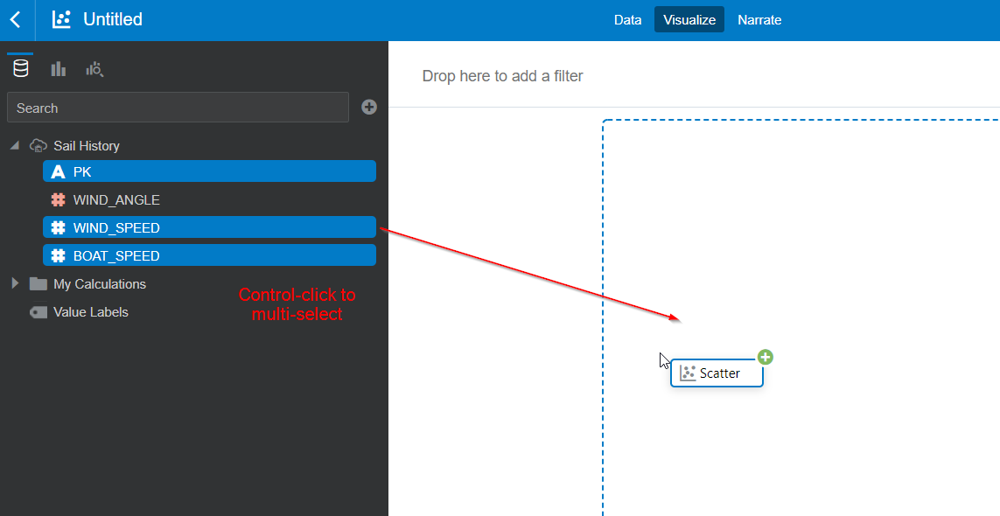
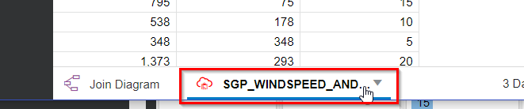
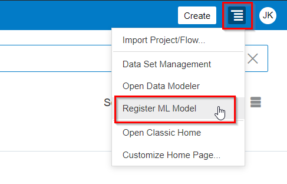
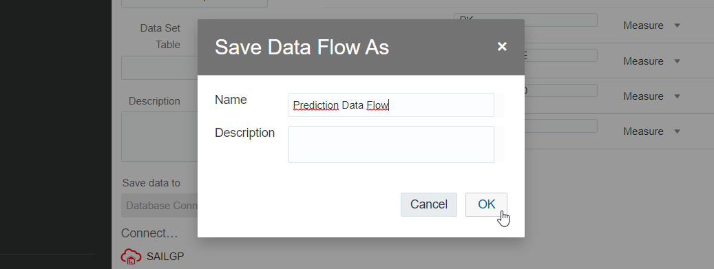
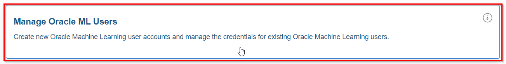

<!--
This works:
only select OML
(don't do tablespace)
(don't do web)
then after do REST enable with separate option
then use SQL to add quota: ALTER USER sailor13 QUOTA UNLIMITED ON Data
-->

# Machine Learning


## Introduction
In this lab, you will use machine learning to solve a very common challenge in sailing: finding the best course to sail. With the optimal course, we mean **which angle to the wind the boat to sail** to **obtain the highest boat speed** in our target direction, given a particular wind speed.

You will train a machine learning model that will find the relationship between wind speed, wind angle and boat speed.

The machine learning takes place in the Autonomous Data Warehouse and Oracle Analytics Cloud will pick up the resulting predictions from the database and visualize them.

Estimated Lab Time: 25 minutes

### Objectives
In this lab, you will:
- Learn some basic machine learning principles, which you can apply to a myriad of (business) problems.
- Learn how you can perform machine learning in Autonomous Data Warehouse, and analyze the results in Oracle Analytics Cloud, without having to be a data science expert!

### Prerequisites
- An Oracle Free Tier, Always Free, Paid or LiveLabs Cloud Account
- Oracle Analytics Cloud
- Autonomous Data Warehouse
- A configured connection between Oracle Analytics Cloud and Autonomous Data Warehouse

## **STEP 1:** Planning our approach
For this case, we will imagine that our **goal is to try to sail upwind** (into the direction of the source of the wind) as fast as possible. Different angles result in different boat speed, for example:
- Going directly upwind with angle 0 (straight into the wind) is not possible at all.
- Taking a wide angle of 60+ degrees (e.g. "Wind angle 2") will result in a high boat speed, but it will not bring us to our target as quickly as possible (going vertically "up").
- Taking a less wide angle (e.g. "Wind angle 1") will result in a less high boat speed, but may actually bring us to our target faster.

Therefore, there is an optimal wind angle, and it is up to us to find it. However, this is not so easy; every boat has its own characteristics and responds with a different speed to the wind angle and wind speed in a non-linear way. There's a complex relationship between this variables!


We will attack the problem in two phases:

1) Predict the actual boat speed (green) based on wind speed (red) and wind angle (blue). We will use machine learning to do this.

2) Decompose the boat speed and extract its "vertical" component (purple) towards the wind. This is the speed we're finally interested in. It's nice for the boat to go fast, but only the vertical speed (up towards the wind) is what counts.

## **STEP 2:** Machine Learning - Data Exploration

Predict the actual boat speed (green) based on wind speed (red) and wind angle (blue).

In the past we've gone onto the water with our boat many times in different wind conditions, and we've measured wind speed, wind angle and the resulting boat speed. This has resulted in a data set with many measurements. Let's have a look at this data.

1. Open Oracle Analytics Cloud.

   From the  **Oracle Cloud Infrastructure console** click on the menu icon on the left.
   **Navigate** to **Analytics** and then **Analytics Cloud**.

   

7. **Open** the Cloud Analytics **URL** associated with your instance (the one that we created in Lab 2) by using the dots menu button on the right-hand side of your instance information and selecting **Analytics Home Page**.

    

8. Let's have a look at our measurements.

   Create a new dataset.

   

9. Select our database connection.

   

10. Double click the **SGP_SAIL_HISTORY** table in the **SAILOR** schema.

    

    Here you see the results of the measurements of our past trips with the boat; Every measurement is a combinations of wind speed, wind angle and resulting boat speed.

11. Open the contents of the table by clicking on SGP_SAIL_HISTORY at the bottom of the screen.

    

12. Click on the PK column (this holds a simple counter for each measurement). On the bottom left of the screen, change "Treat As" to "Attribute".

    

13. Save the Data Set and name it "Sail History".

    

14. From the Home Page. Choose to create a new Project.

    

15. Select the PK, WIND_SPEED and BOAT_SPEED columns (use control-click) and drag them to the canvas to create a new visualization.

    

    Conclusion: There appears to be some correlation between wind -speed and boat speed, as you would expect. But it's not just a simple straight line!

    

17. Create a new visualization from PK, WIND_ANGLE and BOAT_SPEED and drag it to just above the original chart (the area will be highlighted in blue).

    

   Conclusion: There also appears to be a relationship between WIND_ANGLE and BOAT_SPEED as well. There's a clear concentration of points in the top of the chart. However, there are also many points further down.

   

18. Drag the WIND_SPEED to the **Color** component. With this we're trying to visualize the relationship between all three variables.

   

   Conclusion: We see correlation between wind speed, wind angle and boat speed. However, it's very difficult to find the exact relationship. As mentioned before, the relationship between wind speed, wind angle and boat speed is **non linear**.

   On top of that, it's fair to assume that there will be some amount of error in our readings, it's notoriously difficult to measure things like wind speed and wind angle accurately.

   These things together makes it pretty hard for us, human beings, to find these relationships.

   But luckily for us, Machine Learning is great at extracting these type of patterns! It is able to cut through the noise and find relationships between variables!

## **STEP 3:** Machine Learning - Building the model

1. Open the Autonomous Data Warehouse.

   From the Oracle Console, click **Oracle Database** > **Autonomous Data Warehouse**.

   

2. Click on the SAILGP database that you created earlier.

   

3. Open the Service Console

   

4. Choose Development > Oracle Machine Learning Notebooks.

   

5. Sign in with the user **SAILOR**, password **Oracle_12345**

   

6. Start AutoML

   

7. Select **Create Experiment**

   

8. Now we have to select how to train our model.
   The table in which we have our measurements to train on is SAILOR.SGP_SAIL_HISTORY.
   We want to predict **boat speed** from **wind speed** and **wind angle**, therefore for "Predict" select BOAT_SPEED and in the features select WIND_ANGLE and WIND_SPEED. We will use PK as a way to uniquely identify each measurement.

   Configure the Experiment as follows:

   

9. Lastly, in the Additional Settings, set Database Service Level to "High". This will help us build the model faster.

   

10. Now start the training of the model.

    On the top right choose "Start" > "Faster Results".

   

11. The training will take several minutes. During this time, AutoML tries out several different ML algorithms, with different configurations.

    The value under "Negative Mean Squared Error" is an indicator of the accuracy of the model.

    

    We will use the **Support Vector Machine (Gaussian) model**.

    **Make a note of the exact model name, including the number. You will need this later.**

## **STEP 3:** Machine Learning - Predicting boat speed in Oracle Analytics Cloud

Now it's time to make predictions with the model. We will make a prediction for a combination of wind speeds (5, 10, 15, 20 and 25 mph) and range of wind angles (0-180 degrees with 1 degree increments).

1. Create a new dataset.

   

2. Select the connection to our Autonomous Data Warehouse.

   

3. Double click on the SGP_WINDSPEED_AND_WINDANGLES table (under the **SAILOR** user).

   

    You see that this table holds these combination of wind speeds and wind angles. The table **does not yet have** the boat speed. We will predict the boat speed from these two values.

4. Click on the table name at the bottom of the screen.

   

5.

   

   

   

   

   

   

   

   

   

   


2. Go to **Menu** > **XXX** > **XXX**.

   

   > Note: XXX.

3. Click **XXX**.

   

4. Select **XXX** and click **XXX**.

   

5. Change the **XXX** and leave everything else as **default**.

      - XXX Name: `xxx`

6. Click **Next**.

   

7. **Download** the dataset <a href="https://objectstorage.eu-frankfurt-1.oraclecloud.com/p/27PK5yRJp6ikvVdli-21D0vTwNywA0Q1aUPD2RQ7G8rtbPQwO2onh7TaZjfjawPj/n/odca/b/workshops-livelabs-do-not-delete/o/mds-di-ds-reef_life_survey_fish.csv" target="\_blank">File To Download</a>.

8. On **XXX**, create `xxxx` xxxx.

      ```
      <copy>bash command</copy>
      ```

## **STEP 2:** XXX

1. Xxx xxx **xxx** (with access from the Internet) and a **xxx** xxx.

   xxx.

2. Go to **Menu** > **XXX** > **XXX**.

   

   > Note: XXX.

3. Click **XXX**.

   

4. Select **XXX** and click **XXX**.

   

5. Change the **XXX** and leave everything else as **default**.

      - XXX Name: `xxx`

6. Click **Next**.

   

7. **Download** the dataset <a href="https://objectstorage.eu-frankfurt-1.oraclecloud.com/p/27PK5yRJp6ikvVdli-21D0vTwNywA0Q1aUPD2RQ7G8rtbPQwO2onh7TaZjfjawPj/n/odca/b/workshops-livelabs-do-not-delete/o/mds-di-ds-reef_life_survey_fish.csv" target="\_blank">File To Download</a>.

8. On **XXX**, create `xxxx` xxxx.

      ```
      <copy>bash command</copy>
      ```

## **STEP 3:** XXX


1. Xxx xxx **xxx** (with access from the Internet) and a **xxx** xxx.

   xxx.

2. Go to **Menu** > **XXX** > **XXX**.

   

   > Note: XXX.

3. Click **XXX**.

   

4. Select **XXX** and click **XXX**.

   

5. Change the **XXX** and leave everything else as **default**.

      - XXX Name: `xxx`

6. Click **Next**.

   

7. **Download** the dataset <a href="https://objectstorage.eu-frankfurt-1.oraclecloud.com/p/27PK5yRJp6ikvVdli-21D0vTwNywA0Q1aUPD2RQ7G8rtbPQwO2onh7TaZjfjawPj/n/odca/b/workshops-livelabs-do-not-delete/o/mds-di-ds-reef_life_survey_fish.csv" target="\_blank">File To Download</a>.

8. On **XXX**, create `xxxx` xxxx.

      ```
      <copy>bash command</copy>
      ```

Congratulations! You are ready to go to the next Lab!

## **Acknowledgements**

- **Author** - Jeroen Kloosterman, Technology Product Strategy Director
- **Author** - Victor Martin, Technology Product Strategy Manager
- **Contributors** - XXX


We have dataset with a long list of measurements of the combination of wind speed, wind angle and boat speed.


First of all, we want to try to predict the

The way that a boat responds by speeding up / slowing down to wind angle and wind speed is very specific to every boat.

In our case, we have


Our goal is to predict what the boat speed will be for any combination of wind speed and wind angle. Because if we are able to do that, we can use it to **choose the optimal wind angle that will result in the highest speed** (towards our target).


During the data exploration phase, we will investigate what data we have and the correlation that our potential input variables (wind speed and wind angle) have with our target variable (boat speed).

<!--
   

   

   
-->
