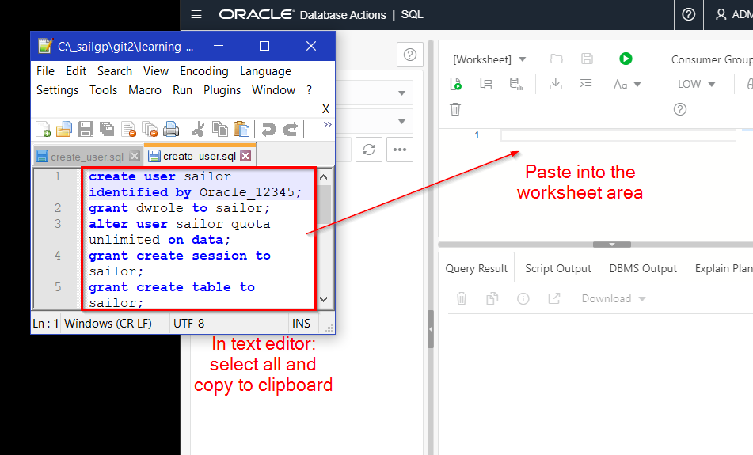
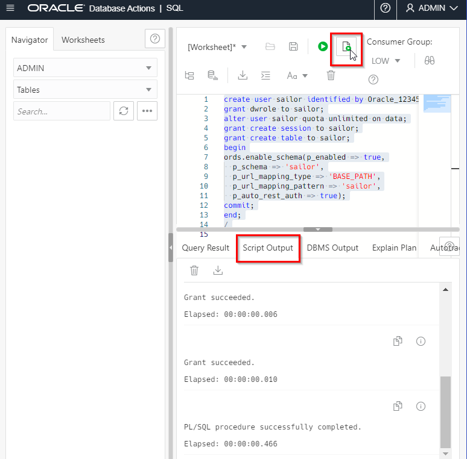
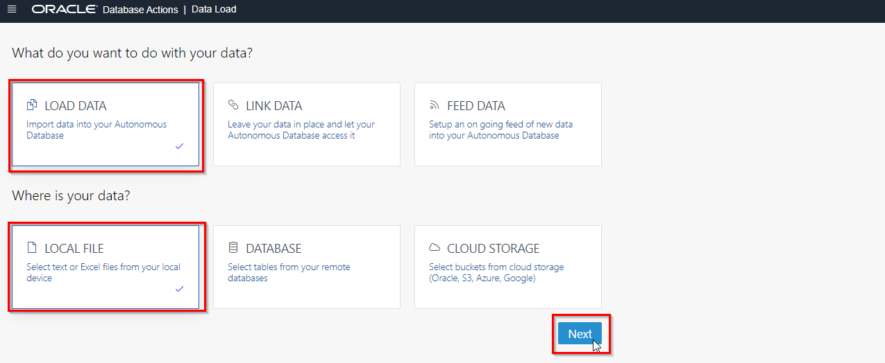
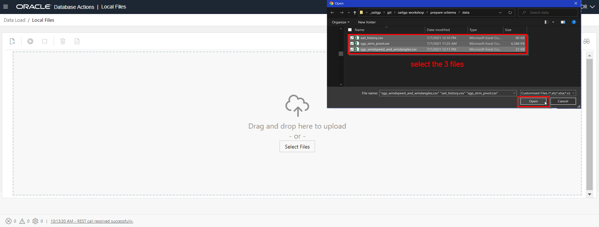

# Load Data

## Introduction
In this lab you will load the SailGP data into the Autonomous Data Warehouse. You will first create a new user/schema that will hold this data. After this lab we will be ready to start analyzing the data.

_Estimated Lab Time:_ 5 minutes

### Objectives
- Learn how to load data into the data warehouse, so you can analyze it later.

### Prerequisites
To complete this lab, you need to have the following:
- A provisioned Autonomous Data Warehouse
- You're logged into your Oracle Cloud Account

## **STEP 1**: Create a new database user/schema in Autonomous Data Warehouse

This new user/schema will hold the SailGP data.

1. Go to **Menu** > **Oracle Database** > **Autonomous Data Warehouse**.

   

2. Click on the **SAILGP** database that you created earlier.

   

3. Go to **Tools** tab and click **Open Database Actions**.

   

   Login with user **ADMIN**, password **Oracle_12345** (you specified this upon creation of the Autonomous Data Warehouse earlier).

4. Click the **SQL** tile under **Developer** section.

    

5. **Download** the <a href="https://objectstorage.eu-frankfurt-1.oraclecloud.com/p/JbEdrEEaFEEwmhXdC-nsEdRIJpqz1cQ30LYa7g2E-aYFopABGTNM9Hkp0u5mVRfQ/n/odca/b/workshops-livelabs-do-not-delete/o/sailgp_create_user.sql" target="\_blank">`sailgp_create_user.sql`</a>. Save the file on your local machine. Make sure that the file is saved with extension `.sql`.

    1. Open the `sailgp_create_user.sql` file with a text editor and copy-and-paste all of its contents from the file into the worksheet area.

    

    1. Click the run-script button (**not** the Run button). Then verify the output in the **Script Output** tab. The last lines in the output should indicate that the script has run successfully.

    

<!--
4. We're going to first create a new database user/schema that will hold the SailGP data. Open "Database Users".

   

5. Choose "Create User"

   

6. Fill in the following details:
      - User Name:  `SAILOR`
      - New Password: `Oracle_12345`
      - Confirm Password: `Oracle_12345`
      - Quota on tablespace DATA: `UNLIMITED`
      - Check "Web Access"
      - Check "OML"

   Then Create the User.

   

7. Next, give the user the access necessary to upload files through the Web UI.

   

   Confirm by clicking "Rest Enable User".
-->

## **STEP 2**: Upload SailGP data to Autonomous Data Warehouse

1. **Download** the three files that contain the data that we'll use in our analysis:
   
   - <a href="https://objectstorage.eu-frankfurt-1.oraclecloud.com/p/azjOfz91f8jdUPfvkxVzVUFtb2n-Jj_lXYaWQhvgCLsnOMMPvpLruqaAf5sJduNc/n/odca/b/workshops-livelabs-do-not-delete/o/sailgp_sgp_strm_pivot.csv" target="\_blank">File 1</a>
   - <a href="https://objectstorage.eu-frankfurt-1.oraclecloud.com/p/5yCpZHlzTE70fotF5LS7sYpIQfOi-XdSQ8DhQRSVsClX7cxIq7YvpmSS8wxX5gaM/n/odca/b/workshops-livelabs-do-not-delete/o/sailgp_sgp_sail_history.csv" target="\_blank">File 2</a>
   - <a href="https://objectstorage.eu-frankfurt-1.oraclecloud.com/p/s-A4eEJl4OxSdt02-TcTyz-bQvC_IGczI_PLRflfXx_gzosdKk5t97qMp2UtZ_OU/n/odca/b/workshops-livelabs-do-not-delete/o/sailgp_sgp_windspeed_and_windangles.csv" target="\_blank">File 3</a>
   
   Save the files on your local machine. Make sure that the files are saved with extension `.csv`.

2. Next, come back to your `SAILGP` ADW console, go to **Tools** tab and click **Open Database Actions**.

   > You should still have a browser tab open with the main page of the Autonomous Data Warehouse service. If not, navigate to this page first. Then, open Database Actions.

   **_IMPORTANT_: This time, login with user `SAILOR`, password `Oracle_12345` (Don't login with ADMIN)**

   

3. Click to the **Data Load** option, under the **Data Tools** section.

   

4. Choose **Load Data** to answer the first question and **Local Files** to answer the second one. Click **Next**.

    

5. Select the 3 files that you downloaded earlier.

    

6. Click the **Play** button to start the process and click **Run** on the **Run Data Load Job** verification window.

    

7. This process takes between 10-30 seconds. You will see the green ticks when done.

    

Congratulations! You've successfully loaded the data into Autonomous Data Warehouse.

You can now proceed to the next lab.

## **Acknowledgements**

- **Author** - Jeroen Kloosterman, Technology Product Strategy Director
- **Author** - Victor Martin, Technology Product Strategy Manager
- **Contributor** - Priscila Iruela
